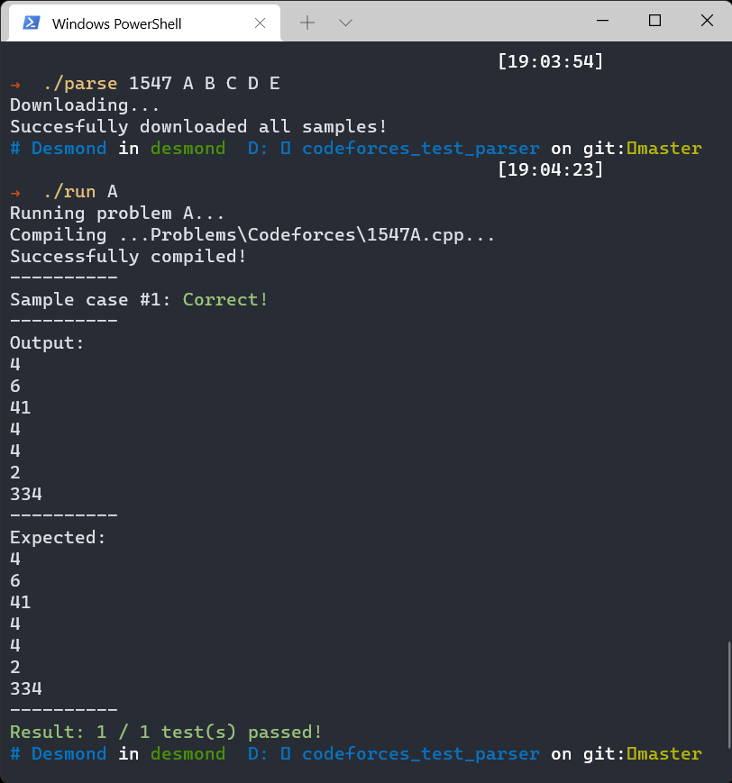

# Codeforces Test Parser for C/C++ & Python on Windows

<p align="center">
  
</p>

### Installation
* Run ```pip install beautifulsoup4 requests``` in your terminal.
* Clone this repository!
* Change ```workspace_folder``` in ```run.py``` to the folder where your source files are located.
* Please make some changes in ```run.py``` to make it suitable for your folder structure. Below is mine.

### Folder structure
```
Codeforces
    |   ...
    |   1620A.cpp
    |   1620B.cpp
    |   ...
codeforces_test_parser
    |---samples
    |      |---[contest_id] # e.g. 1620
    |               |---A
    |                   |   input0.txt
    |                   |   output0.txt
    |                   |   ...
    |               |---B
    |               |---...
    |   parse.py
    |   run.py
```

### Usage
* Use ```.\parse [contest_id] [problem_id1] [problem_id2] ...``` to download sample test cases.
For example: ```.\parse 1620 A B C D E``` to download problem A, B, C, D, and E from Educational Codeforces Round 119 (contest id is 1620).

* Use ```.\run [problem_id]``` to run sample test cases (only one problem at a time).
For example: ```.\run A``` for testing problem A.

* In case your default application for ```.py``` files is not Python, e.g. PyCharm, VSCode, etc. Please use ```python parse.py``` instead of ```.\parse``` and ```python run.py``` instead of ```.\run```.

* This parser is C++-first, which means it will build Python file only after no C++ file has been found.

If you find this repository useful, please give it a star :star:!
